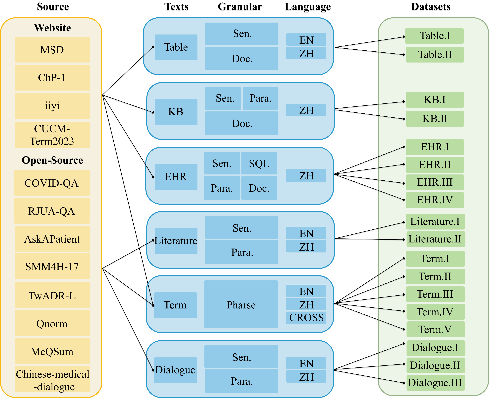
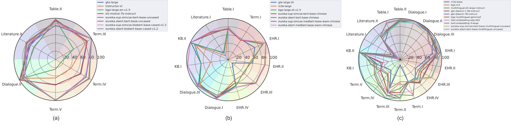

# MedEureka: A Medical Domain Benchmark for Multi-Granularity and Multi-Text-Type Embedding-Based Retrieval

## Introduction

Welcome to MedEureka, an enriched medical benchmark for Multi-Granularity and Multi-Text-Type Embedding-Based Retrieval. MedEureka includes four levels of granularity and six types of medical texts, encompassing 18 datasets, incorporating granular and semantic tags to prompt instruction-fine-tuned text embedding models for embedding generation. We also provide the MedEureka Toolkit to support evaluation on the MedEureka test set. Here is the Architecture of MedEureka.
<div align="center">
  
</div>

## Dataset Statistics
| **Task**   | ID   | **Source**                 | **Language** | **Annotation**     | **Phrase** | **Sen.** | **SQL** | **Para.** | **Doc.** | **# Examples(train/dev/test)** | **# Avg Len (query/target)** |
|------------|------|----------------------------|--------------|--------------------|------------|----------|---------|-----------|----------|---------------------------------|--------------------------------|
| **Table**  | I    | Website                    | zh           | Auto & Human        | -          | ✔️        | -       | -         | ✔️        | 1,776/592/592                   | 105.80/2811.27                |
|            | II   | Website                    | en           | Auto & Human        | -          | ✔️        | -       | -         | ✔️        | 806/269/269                     | 60.08/561.42                  |
| **Literature** | I    | RJUA-QA                   | zh           | Auto & Human        | -          | ✔️        | -       | ✔️        | -        | 360/120/120                     | 204.11/264.25                 |
|            | II   | COVID-QA                   | en           | Auto & Human        | -          | ✔️        | -       | -         | ✔️        | 979/327/326                     | 12.77/6065.79                 |
| **KB**     | I    | Website                    | zh           | Auto & Human        | -          | ✔️        | -       | ✔️        | -        | 985/330/328                     | 188.76/192.09                 |
|            | II   | Website                    | zh           | Auto & Human        | -          | ✔️        | -       | -         | ✔️        | 1967/657/656                    | 158.36/1823.71                |
| **Term**   | I    | Website                    | zh           | Auto & Human        | ✔️ ✔️       | -        | -       | -         | -        | 3,015/1,005/1,005               | 15.26/13.44                   |
|            | II   | Website                    | cross        | Auto & Human        | ✔️ ✔️       | -        | -       | -         | -        | 24,786/8,262/8,262              | 6.38/12.91                    |
|            | III  | AskAPatient                | en           | Auto                | ✔️ ✔️       | -        | -       | -         | -        | 5,051/2,748/4,137               | 4.36/4.03                     |
|            | IV   | SMM4H-17                   | en           | Auto                | ✔️ ✔️       | -        | -       | -         | -        | 2,124/709/1,194                 | 4.20/5.45                     |
|            | V    | TwADR-L                    | en           | Auto                | ✔️ ✔️       | -        | -       | -         | -        | 3,204/656/988                   | 4.32/4.51                     |
| **EHR**    | I    | Self-built                 | zh           | Auto & Human        | -          | ✔️        | ✔️       | -         | -        | 2,097/718/721                   | 45.98/69.27                   |
|            | II   | Website                    | zh           | Auto & Human        | -          | ✔️        | -       | ✔️        | -        | 1,709/570/570                   | 48.17/191.72                  |
|            | III  | Website                    | zh           | Auto & Human        | -          | -        | ✔️       | ✔️        | -        | 1,692/564/564                   | 71.37/191.72                  |
|            | IV   | Website                    | zh           | Auto & Human        | -          | ✔️        | -       | -         | ✔️        | 1,229/410/410                   | 72.62/976.30                  |
| **Dialogue** | I    | Qnorm                      | zh           | Auto                | -          | ✔️ ✔️       | -       | -         | -        | 959/320/320                     | 93.63/100.18                  |
|            | II   | MeQSum                     | en           | Auto                | -          | ✔️        | -       | ✔️        | -        | 600/200/200                     | 13.69/81.41                   |
|            | III  | Chinese-medical-dialogue   | zh           | Auto & Human        | -          | ✔️ ✔️       | -       | -         | -        | 1,800/600/600                   | 87.46/85.31                   |

Here are the dataset statistics and descriptions. The columns represent the annotation method (auto-generated or human), the number of examples, the granularity, and the average length of both query and target.

## Baselines
We selected the traditional information retrieval method BM25, recent state-of-the-art embedding models, and some advanced instruction-fine-tuned embedding models as baselines. Meanwhile, we chose two mainstream supervised training methods, SimCSE and SBERT, to train on the MedEureka dataset as training baselines. The basic information for these models are as follows:

| **Model** | **Language** | **Max Length** | **Hidden Size** | **Instruction** | **Publish Time** |
|-----------|--------------|----------------|-----------------|-----------------|------------------|
| text-embedding-ada-002 | multi-lingual | 8,192 | 1,536 | ❌ | 2022.12 |
| text-embedding-3-large | multi-lingual | 8,192 | 3,072 | ❌ | 2024.01 |
| gte-large-zh | zh | 512 | 1,024 | ❌ | 2023.12 |
| gte-large | en | 512 | 1,024 | ❌ | 2023.12 |
| Instructor-xl | en | 512 | 1,024 | ✔️ | 2023.01 |
| bge-large-en-v1.5 | en | 512 | 1,024 | ✔️ | 2023.12 |
| bge-large-zh-v1.5 | zh | 512 | 1,024 | ✔️ | 2023.12 |
| bge-m3 | multi-lingual | 8,196 | 1,024 | ❌ | 2024.01 |
| m3e-base | multi-lingual | 512 | 768 | ❌ | 2023.06 |
| m3e-large | zh | 512 | 1,024 | ❌ | 2023.06 |
| e5-mistral-7b-instruct | en | 32,768 | 4,096 | ✔️ | 2023.12 |
| multilingual-e5-large-instruct | multi-lingual | 512 | 1,024 | ✔️ | 2024.02 |
| gte-Qwen2-1.5B-instruct | multi-lingual | 32,768 | 1,536 | ✔️ | 2024.06 |
| gte-Qwen2-7B-instruct  | multi-lingual | 32,768 | 1,536 | ✔️ | 2024.06 |
| bge-multilingual-gemma2 | multi-lingual | 8,192 | 3,584 | ✔️ | 2024.07 |
| **BERT Models** | | | | | |
| bert-base-uncased  | en | 512 | 768 | ❌ | 2019.01 |
| biobert-base-cased-v1.2 | en | 512 | 768 | ❌ | 2021.01 |
| bert-base-chinese | zh | 512 | 768 | ❌ | 2021.01 |
| medbert-base-wwm-chinese | zh | 512 | 768 | ❌ | 2021.05 |
| bert-base-multilingual-uncased | multi-lingual | 512 | 768 | ❌ | 2019.01 |


## Overall Evaluation Results
<div align="center">
  
</div>

## Installation

Install via pip:

```python
$ git clone https://github.com/JOHNNY-fans/MedEureka.git
$ cd MedEureka
$ pip install -r requirements.txt
```

Tested with python versions 3.10, cuda-toolkit 12.1

## To do

We will provide access to the finetuned baseline models in the future.

